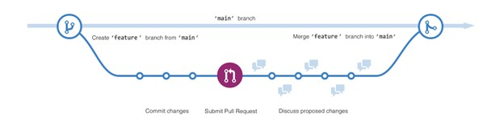

# Инструкция для работы с Git и удалёнными репозиториями

## Что такое Git?

Git - это одна из реализаций распределённых систем контроля версий, имеющая как и локальные, так и удалённые репозитории. Является самой популярной реализацией систем контроля версий в мире.
Официальный сайт:
https://book.git-scm.com/

## Подготовка репозитория
Для создание репозитория необходимо выполнить команду git init в папке с репозиторием и у Вас создаться репозиторий (появится скрытая папка .git)

## Создание коммитов
Git add
Для добавления измений в коммит используется команда git add. Чтобы использовать команду git add напишите git add <имя файла>

## Просмотр состояния репозитория
Для того, чтобы посмотреть состояние репозитория используется команда git status. Для этого необходимо в папке с репозиторием написать git status, и Вы увидите были ли измения в файлах, или их не было

## Создание коммитов
Для того, чтобы создать коммит(сохранение) необходимо выполнить команду git commit. Выполняется она так: git commit -m "<сообщение к коммиту>. Все файлы для коммита должны быть ДОБАВЛЕНЫ и сообщение к коммиту писать ОБЯЗАТЕЛЬНО.

## Перемещение между сохранениями
Для того, чтобы перемещаться между коммитами, используется команда git checkout. Используется она в папке с пепозиторием следующим образом: git checkout <номер коммита>

## Журнал изменений
Для того, чтобы посмтреть все сделанные изменения в репозитории, используется команда git log. Для этого достаточно выполнить команду git log в папке с репозиторием.

## Ветки в Git
Здесь написан конфликтный текст
Здесь написан конфликтный текст
Здесь написан конфликтный текст

Слияние веток
Для того чтобы дабавить ветку в текущую ветку используется команда git merge
На этой схеме показано следующее:

1 ветвь main;

2 новая ветвь с именем feature;

3 путь который проходит feature до слияния с main;

Дополнительные источники с инструкциями:
https://docs.github.com/ru/get-started/quickstart/hello-world
https://proglib.io/p/git-for-half-an-hour
https://selectel.ru/blog/tutorials/git-setup-and-common-commands/

Эта инстукция разработана автоматически 
Вавилов Сергей не разрабатывал ее